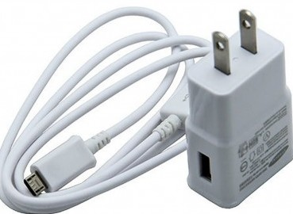
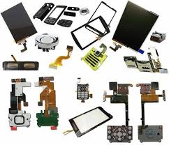

# Taller y Tienda  de Celulares Fixcell.

## Autor 
* Karen Nadieska Sánchez.

## Tecnologías
* JavaScrip
* CSS
* HTML
* MarkDowm

## Descripción de la Página
La estructura de este sitio Web se divide en las siguientes secciones:

##  1. *Menú*

* Inicio: Encontraremos una breve una introducción, describiendo el negocio y los servicios que ofrecen.

* Servicios: Encontraremos todos los servicios que ofrecen, reparación, flasheo, desbloqueo, liberación, explicando en qué consisten cada uno de ellos para que el cliente no tenga dudas de lo que se le realizara a su dispositivo móvil.

* 	Formulario de contacto: Se mostrara como llegar al local, y el número de teléfono para localizar al propietario.

*	Accesorios: Se mostrara la funcionalidad de todos los accesorios que el negocio ofrece.

* Galería de imágenes: encontraremos fotos de todos los accesorios que ofrecen como fundas para móvil, cargadores, audífonos, dispositivos móviles, protectores para pantalla y mucho más.

```html
<div class="navbar-fixed">
  <nav class="black">
    <div class="nav-wrapper">
      <div class="container">
        <a href="#" class="brand-logo">Fixcell</a>
        <a href="#" data-activates="mobile-menu" class="button-collapse"><i class="material-icons">menu</i></a>
        <ul class="right hide-on-med-and-down">
          <li><a href="#">Inicio</a></li>
          <li><a href="#">Accesorios</a></li>
          <li><a href="#">Servicios</a></li>
          <li><a href="#">Galería</a></li>
        </ul>
      </div>
    </div>
  </nav>
</div>
<ul class="side-nav" id="mobile-menu">
  <li><a href="#">Inicio</a></li>
  <li><a href="#">Accesorios</a></li>
  <li><a href="#">Servicios</a></li>
  <li><a href="#">Galería</a></li>
</ul>
```

## 2. *Slider*
Se muestran imagenes referentes al negocio con una breve descripción de sus productos y servicios.También encontrarán un boto que los llevará a las redes sociales del propietario.

```html
<section>
  <div class="slider">
    <ul class="slides">
      <li>
         
        <div class="caption center-align">
          <h3>Conoce nuestros productos!</h3>
          <h5 class="light grey-text text-lighten-3"</h5>
            <br>
            <a class="waves-effect waves-light btn 996633 white-text" target="_blank" href= "https://www.facebook.com/francisco.coreameza"  >Ver Info</a>
        </div>
       
      </li>
      <li>
         
        <div class="caption right-align">
          <h3>Brindamos servicios especializados</h3>
          <h5 class="light grey-text text-lighten-3"></h5>
         
        </div>
      </li>
      <li>
         
        <div class="caption left-align">
          <h3>Encuentra respuestos originales</h3>
          <h5 class="light grey-text text-lighten-3"></h5>
        </div>
      </li>
      <li>
         
        <div class="caption center-align">
          <h3>Somos responsables y confiables!</h3>
          <h5 class="light grey-text text-lighten-3"></h5>
        </div>
      </li>
    </ul>
  </div>
  <!-- 
    
  -->
</section>
```


## 3. *Barra de Búsqueda*
Aquí podrán buscar los diferentes servicios que brinda el negocio.
```html
<section class= "buscar teal darken-1 white-text center">
  <div class= "container"></div>
  <div class= "row"></div>
  <div class= "col s12"></div>
  <h3>Busqueda de servicios</h3>
  <div class= "input-field">
  <input class= "white grey-text autocomplete" placeholder= "Mantenimiento Físico, Liberación, Desbloqueo, Actualizaciones de Software, Accesorios">
   </div>
</section>
```

## 4. *Información Adicional*
Se muestra una breve descripción de la tienda, su ubicación y los encargos que el cliente puede pedirle a la tienda.
```html
<section calass=" cantainer" > 
</section> <div class="row center">
  <div class="col s12 m4">
    <i class="material-icons large cyan-text">room</i>
    <h4>Ubicación</h4>
    <p>Contenido.</p>
  </div>
  <div class="col s12 m4">
    <i class="material-icons large orange-text">star</i>
    <h4>Encargos</h4>
    <p>Contenido.</p>
  </div>
  <div class="col s12 m4">
    <i class="material-icons  large green-text">store</i>
    <h4>Tienda</h4>
    <p>Contenido.</p>
  </div>
</div>

</section>
```

## 5. *Accesorios/Descuento*
Aparecen tarjetas de imagenes de los accesorios que estan en descuento.

```html
<section>
  <div class="container">
    <div class="row"></div>
    <br>
    <h4 class="center teal-text">Accesorios</h4>

    
      
      <div class='row'>
        <div class="col s12 m4">
          <div class='card'>
            
            <div class="card-title"></div>
            <h4>En Descuento</h4>
            <h5>30%</h5>
            
          </div>

          <div class='row'>
              <div class="col s12 m4">
                <div class='card'>
                  
                  <div class="card-title"></div>
                  <h4>En Descuento</h4>
                  <h5>30%</h5>
                  
                </div>

                <div class='row'>
                    <div class="col s12 m4">
                      <div class='card'>
                        
                        <div class="card-title"></div>
                        <h4>En Descuento</h4>
                        <h5>30%</h5>
                        
                      </div>
```

## 6. *Galería de Imagenes*
Se muestran imagenes de los productos que ofrecen.

```html
<section
<div class="container">
    <h4 class="center  indigo-text ">Galería de fotos</h4>
    <div class="row">
      <div class="col s12 m3">
        
    </div>
    <div class="col s12 m3">
        
    </div><div class="col s12 m3">
        
    </div><div class="col s12 m3">
        
    </div><div class="col s12 m3">
        
    </div><div class="col s12 m3">
        
    </div><div class="col s12 m3">
        
    </div>
    <div class="col s12 m3">
        
   
    </div>
    </div>
  
  </div>
</section>
```
## 7. *Contacto*
Podrán dejar su información como su nombre, correo electrónico, etc.

```html
<section>
  <div class="container">
    <h4 class="center indigo-text">Contacta con nosotros</h4>
    <div class="row">
  <form>
    <div class="input-field col s12 l6">
      <input type="text" id="primer_nombre" class="validate">
      <label for="primer_nombre">Primer Nombre</label>
    </div>
    <div class="input-field col s12 l6">
      <input type="text" id="segundo_nombre" class="validate">
      <label for="segundo_nombre">Segundo Nombre</label>
    </div>
    <div class="input-field col s12">
      <input type="email" id="email" class="validate">
      <label for="email" data-error="Correo Inválido" data-success="Correcto">Email</label>
    </div>
    <div class="input-field col s12">
      <textarea id="mensaje" class="materialize-textarea"></textarea>
      <label for="mensaje">Mensaje</label>
    </div>
    <button class="btn waves-effect waves-light blue" type="submit" name="action">Enviar
      <i class="material-icons right">send</i>
    </button>
  </form>
</div>
</div>
</section>
```


